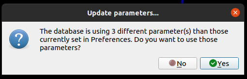

# slam-recipes
A guide to run rtabmap on a dataset of RGBD images to obtain the camera trajectory (with loop closures) and a merged 3D 
point cloud. Original guide and instructions by [Krishna Murthy Jatavallabhula](https://krrish94.github.io/).

# Data
Your sequence at `$SEQUENCE_PATH` should have the following structure:
```shell
├── color
│   ├── 00000.jpg
│   ├── 00001.jpg
│   └── 00002.jpg
└── depth
    ├── 00000.png
    ├── 00001.png
    └── 00002.png
```

# rtabmap
## Install
You should first install rtabmap [from source](https://github.com/introlab/rtabmap/wiki/Installation#if-ros-is-not-installed).
You may be able to skip some dependencies if ROS is already installed.

**Before building**, make sure to replace `rtabmap/tools/RgbdDataset/main.cpp` with the file in this repository. It
includes hardcoded intrinsics for an Azure Kinect camera. You may want to update it with custom intrinsics.

After installing, you may need to run `sudo ldconfig`.


## Running SLAM
Run
```shell
rtabmap-rgbd_dataset --Rtabmap/CreateIntermediateNodes true --Mem/IntermediateNodeDataKept true --RGBD/LinearUpdate 0 --output $SEQUENCE_PATH $SEQUENCE_PATH
```
to generate an `rtabmap.db` file in `$OUTPUT_PATH`.

Now to visualize the point cloud and run additional loop closures:
1. Launch the GUI by running `rtabmap`
2. Load `rtabmap.db` with `File > Open database`.
3. When prompted with the following panel, say 'Yes'
 


4. Then pick `Global map optimized`
 


You should now see your trajectory in the viewer.


## More Loop Closures

If your scan is still globally inconsistent, you can run additional loop closures by
1. In the top menu, select `Tools > Post-processing`.
2. Turn on SBA. Type should be `g2o`. 100 iterations worked well for us.
3. Click `OK`.


## Exporting Pose

Export poses with `File > Export poses > RGBD-SLAM format`. Select `Camera frame`.

This will export poses as translations + quaternions in a `.txt` file. Assuming you exported the rtabmap poses to `$SEQUENCE_PATH/poses.txt`, 
you can convert them to homogenous matrices with
```shell
python3 scripts/export_poses_to_gradslam.py --path $SEQUENCE_PATH --input_file poses.txt
```
The only requirement of the script is `numpy`. The output of this script is the format expected by `gradslam`.

# ORB-SLAM 3
## Install
Again, we need to install ORB-SLAM3 [from source](https://github.com/UZ-SLAMLab/ORB_SLAM3).

**Before building**, make sure to replace `ORB_SLAM3/Examples/RGB-D/rgbd_tum.cc` with the file in this repository.

[TO BE CONTINUED]

